# EstateCore — System Architecture (Deliverable 1)

Market baseline: **Nigeria** (NGN, Paystack/Flutterwave/Remita, NDPR, Lagos Tenancy Law),
architected for global extensibility (multi-currency, multi-jurisdiction from day one).

## 1. Stack decisions

| Layer | Choice | Why |
|---|---|---|
| Backend framework | **NestJS** (over FastAPI) | TypeScript end-to-end with the Next.js frontend (shared DTOs/types), first-class DI/module system that maps cleanly onto the 12 bounded contexts below, built-in guards/interceptors for RBAC + audit logging, native support for both REST and code-first GraphQL, mature CQRS/event patterns via `@nestjs/cqrs`. |
| Frontend | Next.js 14 (App Router) + TypeScript + Tailwind + shadcn/ui | SSR for SEO on public listing pages, RSC for dashboard performance on low-bandwidth connections. |
| Mobile | React Native (Expo) | One codebase for tenant/landlord/field-staff/visitor apps; Expo's SQLite + background sync covers the offline-first requirement for field staff. |
| Primary DB | PostgreSQL | Native Row-Level Security gives per-tenant isolation without per-tenant databases — critical for the 10-to-10,000-unit cost-efficiency requirement. |
| Cache/session/queue | Redis + BullMQ | Single infra dependency covers sessions, cache, and job queues — fewer moving parts to operate on a budget. |
| Search/reporting | Elasticsearch | Read-side of CQRS for the Reporting module; denormalized indices rebuilt from domain events, keeps heavy report queries off the transactional Postgres primary. |
| File storage | Cloudflare R2 (S3-compatible) | No egress fees — matters for document/media-heavy estates on a budget. |
| Auth | Self-issued RS256 JWT (`apps/api/src/modules/auth`) | Built in-house instead of the originally-proposed Supabase Auth, to keep session/refresh-token logic in the same codebase as RBAC. JWT carries `org_id` + role claims consumed directly by Postgres RLS (`current_setting('app.current_org_id')`) and NestJS guards; TOTP MFA mandatory for admin/finance roles. |

## 2. Multi-tenancy model

**Shared database, shared schema, row-level isolation** — not schema-per-tenant or database-per-tenant.

- Every tenant-scoped table carries a NOT NULL `organisation_id`.
- Postgres RLS policies enforce `organisation_id = current_setting('app.current_org_id')::uuid` on every request connection.
- Background workers / SuperAdmin operations run under a dedicated `service_role` with `BYPASSRLS`, never by relaxing the tenant policy itself.

This keeps a 10-unit estate and a 10,000-unit portfolio on the same cluster with no per-tenant provisioning cost, while RLS gives defense-in-depth against cross-tenant leaks even if an application-layer query forgets a `WHERE organisation_id = ...` clause.

## 3. Bounded contexts (modules)

Modeled as NestJS modules inside one deployable (a "modular monolith"), each with its own controllers/services/repositories and an explicit public interface — so any module can be peeled off into its own service later without a rewrite:

Identity & Org · Property & Unit · Tenant & Lease · Financial · Facility & Maintenance · Visitor & Access · Utilities · Community · Document · Reporting & Analytics (CQRS read side) · Compliance & Legal.

Cross-module effects go through an in-process **domain event bus** (e.g. `lease.signed` → Financial module creates the first invoice → Community module notifies the tenant), not direct service-to-service calls. This is what lets the event bus be swapped for NATS/Kafka later without touching business logic.

## 4. Component diagram

```mermaid
flowchart TB
    subgraph Clients
        WEB["Web App (Next.js 14)"]
        MOBTEN["Tenant App (Expo)"]
        MOBOWN["Landlord/Owner App (Expo)"]
        MOBSTAFF["Field Staff App (Expo, offline-first)"]
        MOBVIS["Visitor App (Expo)"]
    end

    subgraph Edge
        CDN["CDN / Static Assets"]
        GW["API Gateway / BFF (REST + GraphQL, rate limiting, WAF)"]
    end

    AUTH["Auth Module (RS256 JWT, TOTP MFA, RBAC claims)"]

    subgraph Core["EstateCore API (NestJS modular monolith)"]
        MOD_PROP["Property & Unit"]
        MOD_LEASE["Tenant & Lease"]
        MOD_FIN["Financial"]
        MOD_MAINT["Facility & Maintenance"]
        MOD_VIS["Visitor & Access"]
        MOD_UTIL["Utilities"]
        MOD_COMM["Community"]
        MOD_DOC["Document"]
        MOD_REPORT["Reporting (CQRS read side)"]
        MOD_COMPLY["Compliance & Legal"]
        EVENTBUS["Domain Event Bus (in-process -> NATS/Kafka later)"]
    end

    subgraph Async["Background Processing"]
        QUEUE["BullMQ Workers: invoicing, reminders, escalations, reports, meter billing"]
        WS["Realtime Gateway (Socket.io): notifications, dashboards, IoT alerts"]
    end

    subgraph Data["Data Layer"]
        PG[("PostgreSQL — primary, RLS multi-tenant")]
        REDIS[("Redis — cache, sessions, queues")]
        ES[("Elasticsearch — search & reporting read models")]
        S3[("Cloudflare R2 — documents, media")]
    end

    subgraph Integrations["External Integrations"]
        PAY["Paystack / Flutterwave / Remita"]
        SIGN["DocuSign / Adobe Sign"]
        COMMS["Twilio (SMS/WhatsApp) / SendGrid / FCM"]
        MAPS["Google Maps / Mapbox"]
        KYC["SmileIdentity / Youverify"]
        IOT["MQTT Broker (meters, sensors)"]
        ACCT["QuickBooks / Xero / Sage"]
        LOCK["Hikvision / Akuvox / Salto REST APIs"]
    end

    MON["Prometheus + Grafana, Sentry, audit logs"]

    WEB --> CDN --> GW
    MOBTEN --> GW
    MOBOWN --> GW
    MOBSTAFF -. offline queue sync .-> GW
    MOBVIS --> GW

    GW --> AUTH
    GW --> MOD_PROP & MOD_LEASE & MOD_FIN & MOD_MAINT & MOD_VIS & MOD_UTIL & MOD_COMM & MOD_DOC & MOD_REPORT & MOD_COMPLY

    MOD_LEASE -- lease.signed --> EVENTBUS
    EVENTBUS -- triggers --> MOD_FIN
    MOD_FIN -- invoice.created --> EVENTBUS
    EVENTBUS --> QUEUE
    QUEUE -- notify --> COMMS
    MOD_VIS --> LOCK
    MOD_UTIL --> IOT
    MOD_FIN --> PAY
    MOD_FIN --> ACCT
    MOD_LEASE --> SIGN
    MOD_LEASE --> KYC
    MOD_PROP --> MAPS

    Core --> PG
    Core --> REDIS
    MOD_REPORT --> ES
    MOD_DOC --> S3
    QUEUE --> REDIS
    Core --> WS

    Core -.-> MON
    QUEUE -.-> MON
```

## 5. RBAC roles

`SuperAdmin` (platform, BYPASSRLS) → `OrgAdmin` → `PropertyManager` / `FinanceOfficer` / `MaintenanceStaff` → `Landlord` / `Tenant` / `SecurityGuard` / `Vendor`. Permissions are granted per-role via a `role_permissions` join table (see schema), checked by NestJS guards on every controller method and mirrored by Postgres RLS for data-layer defense in depth.

## 6. Conventions carried into the schema

- All monetary columns are `BIGINT` storing **kobo** (never floating point).
- All timestamps are `TIMESTAMPTZ` (UTC), converted to user timezone at the presentation layer.
- Every table has `created_at`/`updated_at`; tenant-facing entities also have a nullable `deleted_at` for soft delete.
- Every tenant-scoped table has `organisation_id NOT NULL` + an RLS policy.
- `audit_logs` is append-only (UPDATE/DELETE blocked at the DB level via rules).

---

**Next deliverable (paused for your review):** Database Schema (`db/schema.sql`) implementing the entities above.
